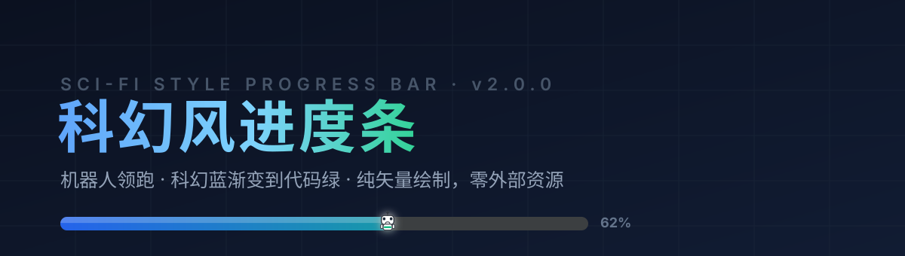
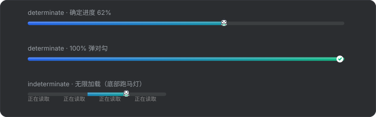

<div align="center">
  

  <h1>Sci-Fi Style Progress Bar</h1>

  <p><b>A sci-fi skin for every progress bar in your JetBrains IDE.</b><br>
  A tiny robot leads a sci-fi-blue → code-green gradient all the way to 100%.</p>

  <p>
    <a href="../../releases/latest"></a>
    
    
    
    
    <a href="../../stargazers"></a>
  </p>

  <p><b>English</b> · <a href="README.md">简体中文</a></p>
</div>

---

## What is this

The progress bar in your IDE has always been a plain grey bar — and you probably stare at it more than you'd like: builds, indexing, dependency downloads.

**Sci-Fi Style Progress Bar** redraws it: a soft grey rounded track, a sci-fi-blue to code-green gradient fill, a mini robot avatar sliding right along with the progress, and a small check mark popping in at 100%. A subtle highlight sits on top of the fill so the gradient reads like a glowing energy bar.

No theme swap, no settings migration, no runtime. It only replaces those few seconds you look at dozens of times a day.

> ### 🧩 Not just IDEA — it covers the whole JetBrains family
>
> **IntelliJ IDEA, PyCharm, WebStorm, GoLand, PhpStorm, CLion, Rider, RubyMine, DataGrip, RustRover, Aqua** — plus anything else built on the IntelliJ Platform, such as **Android Studio**. Same zip, same install steps.
>
> The plugin depends only on `com.intellij.modules.platform` and is not compiled against any single product, so its scope is the **entire IntelliJ Platform**, not one IDE.

## Preview



| State | Behaviour |
|---|---|
| **Determinate · running** | Rounded track with gradient fill; the robot rides the progress head; icon size scales with the bar's height |
| **Determinate · 100%** | The robot is replaced by a white circle with a green check mark, popping in with a slight overshoot |
| **Indeterminate** | A gradient segment slides back and forth, the robot rides its leading edge with a gentle bob, and marquee text scrolls underneath |

> The previews are reconstructed from the plugin's **actual drawing parameters** (coordinates, gradient values, thresholds, icon-scaling formula) — since the plugin is pure vector rendering, there is no bitmap to screenshot.

## Features

| | Feature | Detail |
|---|---|---|
| 🤖 | **Robot runner** | A mini robot avatar moves with the progress; a check mark pops in at 100% with an `easeOutBack` overshoot |
| 🎨 | **Sci-fi blue → code green** | Default gradient `#2563EB → #10B981`, both ends fully customizable |
| ✨ | **Track highlight** | A 21% white highlight over the top half of the fill makes the gradient look like a glowing energy bar |
| 🔁 | **Indeterminate mode** | The segment slides back and forth, the robot rides its leading edge with a bob, and marquee text scrolls below |
| 📐 | **Size adaptive** | The icon scale is derived from the bar height, so short status-bar bars are never clipped |
| ⚡ | **Pure vector drawing** | Rendered entirely with `Graphics2D` — no GIF, PNG or any external animation asset |
| 🪶 | **Animation on demand** | The 30ms timer only runs during indeterminate mode or the check animation; Swing's built-in animation timer is suppressed to avoid double repaints |
| 👀 | **No more white bar** | It rewrites `UIManager`'s `ProgressBarUI` default, so every `new JProgressBar()` gets the skin at construction time (see "How the skin is installed") |
| 🌗 | **Instant theme adaptation** | Track and text colours are resolved from the background lightness inside `paint()`, so switching New UI / Darcula / light / dark themes takes effect immediately |
| 🧩 | **Whole JetBrains family** | Depends only on `com.intellij.modules.platform` — one package for IDEA, PyCharm, WebStorm, GoLand, CLion, DataGrip and the rest |
| 🎛️ | **Configurable nearby** | Options live under Appearance & Behavior, with a colour picker and a speed slider |
| 🔌 | **Non-invasive** | Touches nothing in your project, makes no network calls, registers no background task |

## Installation

### Option 1 — Install from disk (recommended)

1. Download `sci-fi-progress-bar-2.0.0.zip` from [Releases](../../releases/latest)
   > Or use the copy in this repo: [`dist/sci-fi-progress-bar-2.0.0.zip`](dist/sci-fi-progress-bar-2.0.0.zip)
2. In your IDE: `Settings / Preferences` → `Plugins` → ⚙️ → **Install Plugin from Disk...**
3. Select the downloaded **zip (no need to unzip)** and restart the IDE

### Option 2 — Manual drop-in

Extract the zip so that the layout looks like this:

```
<IDE config dir>/plugins/
└── sci-fi-progress-bar/
    └── lib/
        ├── sci-fi-progress-bar-2.0.0.jar
        └── searchableOptions-2.0.0.jar
```

Common `<IDE config dir>` locations:

| OS | Path |
|---|---|
| Windows | `%APPDATA%\JetBrains\<Product><Version>\plugins` |
| macOS | `~/Library/Application Support/JetBrains/<Product><Version>/plugins` |
| Linux | `~/.local/share/JetBrains/<Product><Version>/plugins` |

Restart the IDE afterwards. To remove it, use Uninstall in the `Plugins` panel or delete the folder.

## Settings

Entry point: `Settings / Preferences → Appearance & Behavior → 科幻风进度条`

| Option | Description | Default |
|---|---|---|
| Enable Sci-Fi progress bar skin | Master switch — turn off to restore the stock bar | ✅ On |
| Gradient start colour | Left end of the fill (with colour picker) | `#2563EB` sci-fi blue |
| Gradient end colour | Right end of the fill (with colour picker) | `#10B981` code green |
| Show scrolling text in indeterminate mode | Marquee under the bar | ✅ On |
| Scrolling text | The marquee content | `正在读取` |
| Animation speed | Slider 1–5; higher means faster sliding and marquee | `3` |

> The robot head icon is fixed — it is the signature of this skin.
> Settings persist to `sci-fi-progress-bar.xml` in the IDE config directory.

## Compatibility

- **Plugin ID**: `com.scifi.progress`
- **Minimum build**: `since-build 211` → **2021.1 and newer** (IntelliJ Platform version)
- **Required module**: only `com.intellij.modules.platform`, so it is **product-agnostic**
- **Bytecode target**: Java 11 (`options.release = 11`), loadable on IDEs running JDK 11 – 21

### Supported IDEs

| Category | Products |
|---|---|
| JetBrains official IDEs | IntelliJ IDEA · PyCharm · WebStorm · PhpStorm · GoLand · CLion · Rider · RubyMine · DataGrip · RustRover · Aqua and more |
| Other IDEs built on the IntelliJ Platform | Android Studio and others |

> In one line: **any IDE on the IntelliJ Platform from 2021.1 onwards can wear this skin.** Switching products does not mean switching packages — the same zip works everywhere.

## How the skin is installed

Swing progress bars have two traps: **short-lived components** (the status-bar bars that are created and destroyed within a second, which a tree walk may never reach) and the **default white wide bar**. This plugin solves both with three layers:

**① Effective at construction (primary path)** — it rewrites `UIManager`'s `"ProgressBarUI"` default to point at its own UI class, caches the `Class` object into `UIDefaults`, and provides a static `createUI(JComponent)`. The JDK's `UIDefaults.getUI` looks up the cached `Class` by name and calls `createUI` reflectively, **without going through the plugin classloader**, so any `new JProgressBar()` is already skinned the moment it is constructed.

> The trap here: without a custom `createUI()`, the call inherits `BasicProgressBarUI.createUI` and you get the default bar — visible as a **white wide bar**. That was the root cause of the problem in 1.1 and earlier.

**② AWT component listener (instant fallback)** — it listens for `COMPONENT_ADDED` (covers "added to the display tree") and `COMPONENT_SHOWN` (covers dialogs and popups that are built first and shown later). Note that `COMPONENT_ADDED` is a `ContainerEvent` (ID 601), so `CONTAINER_EVENT_MASK` must be enabled as well.

**③ Periodic scan (final fallback)** — a 2-second walk over every window's component tree, catching anything that slipped through.

Theme switching needs no listener: track and text colours are computed on every `paint()` from `UIUtil.isUnderDarcula()` / the background lightness, so one repaint after a theme change is enough. Clicking Apply in the settings panel re-applies the skin to all windows immediately. Turning the master switch off restores the original `UIManager` default object, leaving nothing behind.

## Building from source

```bash
./gradlew buildPlugin          # output: build/distributions/sci-fi-progress-bar-2.0.0.zip
./gradlew verifyPlugin         # optional plugin verification

# With a local IDE distribution, skipping the SDK download:
./gradlew buildPlugin -PideaLocalPath="/path/to/ideaIC"
```

Use `gradlew.bat` on Windows. Build notes:

- Built with **IntelliJ Platform Gradle Plugin 1.17.4 + Gradle 8.10.2** (wrapper points at a Tencent Cloud mirror)
- Default platform is `2023.1.5 (IC)`; `-PideaLocalPath=` points at a local IDE directory instead
- `updateSinceUntilBuild = false`: only `since-build` is declared, with no upper bound, so the plugin loads on newer IDEs too
- `instrumentCode = false`: no Ant bytecode instrumentation (removed from newer platforms)
- The first build needs network access to the JetBrains CDN (or a mirror) to fetch the platform SDK

## Project layout

```
├── build.gradle.kts                 build script (Java 11 / IntelliJ Platform)
├── gradle/wrapper/                  Gradle 8.10.2 (Tencent Cloud mirror)
├── src/main/java/com/scifi/progress/
│   ├── SciFiProgressBarUI.java      all vector painting and animation
│   ├── ProgressBarSkinner.java      three-layer skin installer + switch rollback
│   ├── SciFiLifecycleListener.java  installs on startup and app re-activation
│   └── settings/                    state / panel / configurable / colour picker
├── src/main/resources/META-INF/plugin.xml
├── images/                          banner and vector previews
└── dist/                            prebuilt installable zip
```

## FAQ

<details>
<summary><b>Installed it but nothing changed?</b></summary>

Check that the master switch is on at `Settings → Appearance & Behavior → 科幻风进度条`. Also, build / index progress bars only appear while a task is running — trigger a Build to see it.
</details>

<details>
<summary><b>Does it work in PyCharm / WebStorm / GoLand and friends?</b></summary>

Yes — with the very same package. The plugin is not compiled against a specific product and depends only on `com.intellij.modules.platform`, so it behaves identically in IDEA, PyCharm, WebStorm, PhpStorm, GoLand, CLion, Rider, RubyMine, DataGrip and RustRover, and the settings entry sits in the same place.
</details>

<details>
<summary><b>Why a 2-second scan? Doesn't that waste performance?</b></summary>

The scan only walks component trees and does `instanceof` checks; bars that are already skinned are skipped immediately, so the cost is negligible. It exists to catch the extreme case of a progress bar created without going through `UIManager` or AWT events. The CPU-heavy part is the animation timer, and that only runs during indeterminate mode or the check animation.
</details>

<details>
<summary><b>Does it conflict with theme plugins?</b></summary>

It only takes over the painting of one component type and modifies no theme colour keys, so it coexists with mainstream theme plugins. If anything looks off, turning the master switch off gives you a precise rollback — the original `UIManager` default is restored.
</details>

<details>
<summary><b>Why not ship animated assets?</b></summary>

Because looking good should not cost performance. Image sequences bring decoding and memory overhead; the vector approach stays sharp on 4K / multi-monitor setups and uses less. The robot, the check mark and the marquee are all drawn live with `Graphics2D`.
</details>

<details>
<summary><b>Does it need network access or project permissions?</b></summary>

No. It performs no network calls, reads nothing from your project and registers no background task — it only paints UI.
</details>

## Changelog

See [CHANGELOG.md](CHANGELOG.md).

**v2.0.0**
- Robot runner, 100% check-mark animation and indeterminate marquee, all drawn as `Graphics2D` vectors
- Icon size scales with the bar height, so short status-bar bars are not clipped
- A top highlight on the fill; the check animation uses an `easeOutBack` overshoot
- The animation timer starts and stops on demand; Swing's built-in animation timer is suppressed
- A standard Gradle plugin project — `gradlew buildPlugin` just works

## Contributing

Found a bug or want a feature? Open an [Issue](../../issues). Before sending code, please keep changes focused on progress-bar rendering, avoid external asset files, and add no resident background tasks.

If this little plugin makes your day slightly nicer, a ⭐ is the best support.

## Support

This plugin makes no network calls, ships no ads, and is not going to be paid-only. If it makes those few seconds of waiting a little nicer, you are welcome to buy me a coffee — entirely optional, and nothing is locked behind it.

<table align="center">
  <tr>
    <td align="center" width="240"><br><b>Alipay</b></td>
    <td align="center" width="240"><br><b>WeChat</b></td>
  </tr>
</table>

## License

[MIT](LICENSE)
